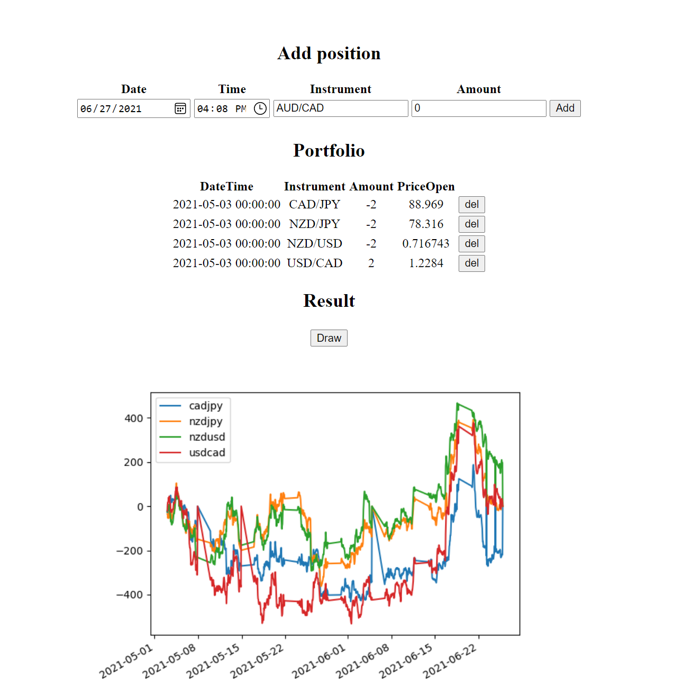

## FAQ
To install, update the package index on your server, if you haven't already:

> ``` sudo apt update ```

### MySQL
___
Then install the mysql-server package, set the root password and create a database with the following parameters:

> ``` create database _db_name_ character set utf8 collate utf8_unicode_ci; ```

Configuring Flask-SQLAlchemy for Flask application in **config.py**

> [DB_TYPE]+[DB_CONNECTOR]://[USERNAME]:[PASSWORD]@[HOST]:[PORT]/[DB_NAME]

### Virtual Environment
___
To create a virtual environment, decide upon a directory where you want to place it, and run the venv module as a script with the directory path:

> ``` python3 -m venv _venv_ ```

Command to activate virtual environment:

> ``` source _venv_/bin/activate ```

Just make sure to upgrade pip:

> ``` pip install --upgrade pip ```

For  virtual environment to install all files in the requirements.txt file:

> ``` pip install -r requirements.txt ```

### Getting started
___
To run the application:
> ``` python main.py ```

Following the link http://127.0.0.1:5000/ you will see everything by yourself :)
